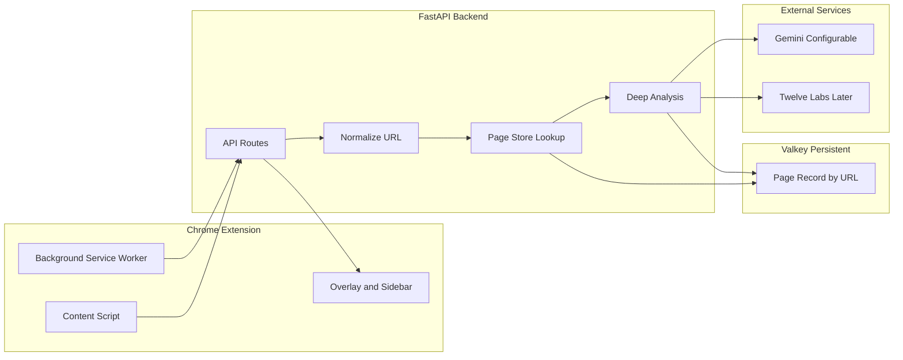

# Odysseus Implementation Plan

This plan implements the **Odysseus** "Reality Layer": Chrome extension frontend, FastAPI backend, **persistent** Valkey storage keyed by **normalized URL**, **configurable LLM model**, and **Gemini-only scores first**, then Twelve Labs, Ariadne, Litmus, Oracle, and Chorus.

---

## Configurable Model

- The reasoning engine **model is configurable** (e.g. `GEMINI_MODEL` in env or `config.py`), not hardcoded.
- Default can be `gemini-1.5-pro`. All Gemini calls use this single configured model so you can switch to Flash, 2.0, or another variant without code changes.

---

## Persistent Storage (URL as Key, No Reprocessing)

All page data is stored **persistently** so the same page is never reprocessed unnecessarily.

1. **Normalize URL**
  When the backend receives a URL, strip unnecessary parts and use the result as the canonical key: remove fragment (`#...`), optionally normalize or strip query params, normalize scheme/host/path (e.g. lowercase host, consistent trailing slash). **Normalized URL** = key for the page record.
2. **What we store (per normalized URL)**
  One persistent record per page:
  - **Content:** Full extracted text + list of associated media (image/video URLs or hashes). Stored so we know what we analyzed.
  - **Text metrics:** Scores from Gemini (humanity, integrity, rhetoric, etc.). Stored so we **do not reprocess** text with Gemini again.
  - **Media metrics:** Placeholder (or future Twelve Labs / image results). Stored so we do not reprocess the same media again.
3. **Flow**
  Extension sends raw URL + page content (text + media refs). Backend **normalizes URL** → key. Look up page record. If record exists and stored content matches (e.g. by hash): return stored text_metrics and media_metrics; no API calls. If missing or content changed: run analysis (Gemini for text first; media later), then **persist** content + metrics (no TTL for page records).

We **start with Gemini-only scores** (text metrics only); media metrics and Twelve Labs are added later. Storage schema reserves a place for media metrics so we don’t reprocess when we add them.

---

## Architecture Overview




- **Extension:** Manifest V3; React for overlay/sidebar; content script for DOM; background for API calls.
- **Backend:** Normalizes URL; one **persistent** page record per URL (content + text_metrics + media_metrics); no TTL on page records; configurable Gemini model.
- **Data flow:** URL + content → normalize URL → lookup page record → if present and content matches, return stored metrics; else run Gemini (then later Twelve Labs), persist, return JSON.

---

## Repository Structure (Proposed)

```
Odyssseus/
├── backend/                 # FastAPI
│   ├── app/
│   │   ├── main.py          # FastAPI app, CORS, routers
│   │   ├── config.py        # Env vars (API keys, Valkey URL)
│   │   ├── routers/         # page_analysis, litmus, chat, ariadne, chorus
│   │   ├── services/        # valkey_client, gemini_service, twelve_labs_service
│   │   └── models/          # Pydantic request/response schemas
│   ├── requirements.txt
│   └── Dockerfile (optional)
├── extension/               # Chrome Extension MV3 + React
│   ├── public/
│   │   ├── manifest.json
│   │   └── (static assets)
│   ├── src/
│   │   ├── background/      # Service worker entry
│   │   ├── content/         # Content script: overlay, DOM hooks, context menu
│   │   ├── sidebar/         # React app for overlay/sidebar UI
│   │   └── shared/          # Types, API client, constants
│   ├── package.json
│   └── (build config for bundling content vs sidebar)
├── docker-compose.yml       # Valkey (and optionally backend for dev)
└── README.md                # Your spec + setup/run instructions
```

---

## Phase 1: The Skeleton (Hours 0–6)

**Goal:** Backend runs, Valkey is connected, extension loads and injects a minimal overlay.


| Task                   | Details                                                                                                                                                                                                                                             |
| ---------------------- | --------------------------------------------------------------------------------------------------------------------------------------------------------------------------------------------------------------------------------------------------- |
| **FastAPI backend**    | Create `backend/` with `main.py`, `config.py` (env: `VALKEY_URL`, `GEMINI_API_KEY`, `**GEMINI_MODEL**` default e.g. `gemini-1.5-pro`), health route and stub `POST /analyze`.                                                                       |
| **Valkey**             | Add Valkey client in `backend/app/services/valkey_client.py`. **Persistent page storage:** key = `odysseus:page:{normalized_url}` (no TTL). Helpers: `get_page(normalized_url)`, `set_page(normalized_url, record)`. Use Docker Compose for Valkey. |
| **URL normalizer**     | In backend, add `normalize_url(url)`: strip fragment, optional query normalization, lowercase host, path normalization. Use output as the only key for page records.                                                                                |
| **Chrome extension**   | Manifest V3: `manifest.json`, `content_scripts`, `background.service_worker`, permissions; minimal React overlay (e.g. score badge). Bundler outputs `content.js` and overlay assets.                                                               |
| **Gemini (text only)** | Add `gemini_service` that uses **configurable model** from config. Takes raw text, returns minimal scores (e.g. humanity 0–100). Used by analyze route; results stored in page record (Phase 2).                                                    |


**Deliverables:** Valkey runs via Docker; FastAPI has configurable Gemini and URL normalizer; extension injects overlay; one route uses Gemini on submitted text. Page persistence (store content + metrics by normalized URL) is implemented so Phase 2 only adds the full score set and Shield UI.

---

## Phase 2: The Shield and Litmus (Hours 6–12)

**Goal:** Page load triggers a score (Shield); selected text can be fact-checked (Litmus).


| Task                          | Details                                                                                                                                                                                                                                                                                                 |
| ----------------------------- | ------------------------------------------------------------------------------------------------------------------------------------------------------------------------------------------------------------------------------------------------------------------------------------------------------- |
| **Content extraction**        | Content script: extract main text and list of media (image/video URLs or refs). Send to backend: `POST /analyze` with **raw URL**, full text, and media list.                                                                                                                                           |
| **Persistent page record**    | Backend: **normalize URL** → key. Load `odysseus:page:{key}`. Record shape: `{ content: { text, media[] }, text_metrics: { humanity, integrity, rhetoric }, media_metrics: {} }`. If record exists and content matches (e.g. text hash), return stored **text_metrics** (and media_metrics); no Gemini. |
| **Deep analysis (slow path)** | On miss or content change: call **Gemini (configurable model)** for (1) Humanity, (2) Integrity, (3) Rhetoric. Aggregate into `text_metrics`. **Persist** full content + text_metrics + media_metrics (empty for now); no TTL. Return to extension.                                                     |
| **Shield UI**                 | Overlay/sidebar shows the three scores (e.g. gauges or badges).                                                                                                                                                                                                                                         |
| **Litmus Test**               | (Optional in Phase 2.) Context menu "Odysseus Check" → `POST /litmus` with claim; Gemini with grounding; show tooltip. Can cache litmus results separately (e.g. by claim hash).                                                                                                                        |


**Deliverables:** Visiting a page shows Shield scores (cached after first load). Selecting text and choosing "Odysseus Check" shows a fact-check result.

---

## Phase 3: Video and Link Graph (Hours 12–18)

**Goal:** YouTube/video analysis via Twelve Labs; Ariadne link graph.


| Task                     | Details                                                                                                                                                                                                                                                                                                                                                                                                                                                                                                    |
| ------------------------ | ---------------------------------------------------------------------------------------------------------------------------------------------------------------------------------------------------------------------------------------------------------------------------------------------------------------------------------------------------------------------------------------------------------------------------------------------------------------------------------------------------------- |
| **Twelve Labs**          | Backend: `twelve_labs_service` (index or direct analyze API, depending on plan). For "YouTube embeds": either pass video URL to Twelve Labs or use their embed/video API. Return deepfake probability and short summary. Integrate into the same `POST /analyze` payload when the page has a video (extension sends video URL or embed selector). Optionally drive **Deepfake Overlay**: if probability &gt; threshold, extension pauses and blurs the video (content script targets `iframe` or `video`). |
| **Shield – video**       | Add a "video" section to the analysis response (e.g. `video.deepfake_score`, `video.summary`). Shield UI shows video-specific warning when relevant.                                                                                                                                                                                                                                                                                                                                                       |
| **Link graph (Ariadne)** | New route `POST /ariadne` or part of `/analyze`: input `url` and list of outbound links/citations. Backend crawls or resolves links (limit depth and count), classifies with Gemini (e.g. "original source" vs "same network"), and builds a graph. Store in Valkey as JSON (or Backboard.io if added). Return nodes + edges.                                                                                                                                                                              |
| **Ariadne UI**           | New panel or sidebar view: render graph (e.g. D3, vis-network, or React Flow). Highlight "pink slime" clusters and broken (404) links; show "original source" vs rest.                                                                                                                                                                                                                                                                                                                                     |


**Deliverables:** Pages with video get a Twelve Labs–based score and optional blur/pause. Ariadne view shows citation graph with basic classification and broken-chain alerts.

---

## Phase 4: Polish and UI (Hours 18–24)

**Goal:** Oracle chat, Chorus, Hype-Filter, and consistent "mythological/cyberpunk" styling.


| Task                        | Details                                                                                                                                                                                                                                                                                                                         |
| --------------------------- | ------------------------------------------------------------------------------------------------------------------------------------------------------------------------------------------------------------------------------------------------------------------------------------------------------------------------------- |
| **Oracle (Chat with Page)** | New route `POST /chat`: body includes `page_html` or cleaned text + `message`, optional `session_id`. Gemini 1.5 Pro (large context) answers; optionally use Valkey to cache session context keyed by `session_id`. Extension: sidebar with chat input and message list; on open, send page content once (or on first message). |
| **Chorus (Perspective)**    | New route `POST /chorus`: input `url`, `topic` or summary. Use Gemini (or search API) to suggest alternative viewpoints (left/right/neutral) and optionally Twelve Labs video summaries. Return list of links + short labels. Sidebar section "Other perspectives" with links.                                                  |
| **Hype-Filter**             | In deep analysis, add Gemini step: "Rewrite this headline to be neutral and factual." Store `neutral_headline` in response. Content script: find main headline (e.g. `h1` or meta og:title), replace text with neutral version (or show both with a toggle).                                                                    |
| **Styling**                 | Theming: dark, high-contrast "mythological/cyberpunk" (e.g. bronze/amber accents, sharp typography, subtle borders). Apply to overlay, sidebar, tooltips, and Ariadne graph.                                                                                                                                                    |
| **Prompts and demo**        | Centralize and tune Gemini prompts (humanity, integrity, rhetoric, litmus, chat, headline rewrite) in backend (e.g. `app/prompts/` or in the service files). Draft a 2–3 minute demo script that walks through Shield, Litmus, Ariadne, Oracle, and Chorus.                                                                     |


**Deliverables:** Chat sidebar works; Chorus suggests alternatives; Hype-Filter rewrites headlines; UI is cohesive and on-theme; demo script ready for video.

---

## Key Technical Decisions

- **Configurable model:** One env var `GEMINI_MODEL` (default `gemini-1.5-pro`); all Gemini calls use it.
- **URL as key:** Normalize URL (strip fragment, optional query normalization, lowercase host, path); use as the **only** key for persistent page storage. No content hash in key—content is stored inside the record; if content changes, we overwrite or update the same record and recompute metrics.
- **Persistent page record:** Key `odysseus:page:{normalized_url}`. Value: `{ content: { text, media[] }, text_metrics: {...}, media_metrics: {...} }`. **No TTL**—persist until explicitly cleared or evicted by policy. Content + metrics stored together so we never reprocess the same text/media.
- **Content matching:** When a request arrives, compare incoming content (e.g. text hash) to stored `content`; if same, return stored metrics only. If different or missing, run analysis and persist new content + metrics.
- **Valkey keys:** `odysseus:page:{normalized_url}` (persistent); optional: `odysseus:litmus:{claim_hash}`, `odysseus:chat:{session_id}` with TTLs if desired.
- **Extension build:** Single repo; build → `extension/dist/`; load unpacked. **CORS:** Allow extension origin.
- **Backboard.io:** Stretch; Ariadne can use Valkey-stored graph first.

---

## Dependencies Summary

- **Backend:** `fastapi`, `uvicorn`, `redis` or `valkey`, `google-generativeai`, `httpx`. Env: `GEMINI_API_KEY`, `**GEMINI_MODEL**` (default `gemini-1.5-pro`), `VALKEY_URL`; later `TWELVE_LABS_API_KEY`.
- **Extension:** React, bundler (Vite/Webpack), TypeScript preferred. No heavy UI framework required; CSS modules or Tailwind for theme.
- **Dev:** Docker (Valkey); Node 18+; Python 3.10+.

---

## README and Devpost

Use your formal spec as the README body (mission, architecture, feature suite, data flow). Add a short "Setup" section: clone repo, `cp backend/.env.example .env`, fill API keys, `docker-compose up -d`, run backend, build extension, load unpacked. For Devpost, reuse the same narrative and add demo video link and "Built with" (Chrome Extension, FastAPI, Valkey, Gemini, Twelve Labs).

This plan keeps the spec’s moving parts (Valkey fast path, Gemini deep analysis, Twelve Labs video, Ariadne graph, Litmus grounding, Oracle chat, Chorus, Hype-Filter) and maps them to concrete phases and files so the team can execute in order.